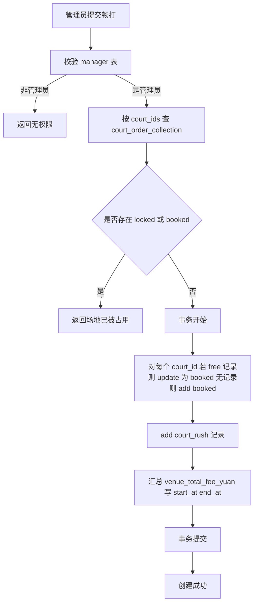
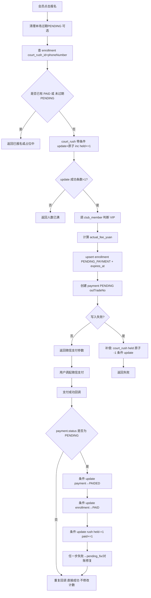
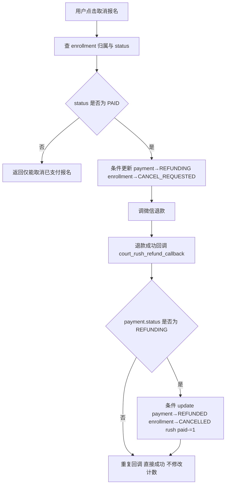
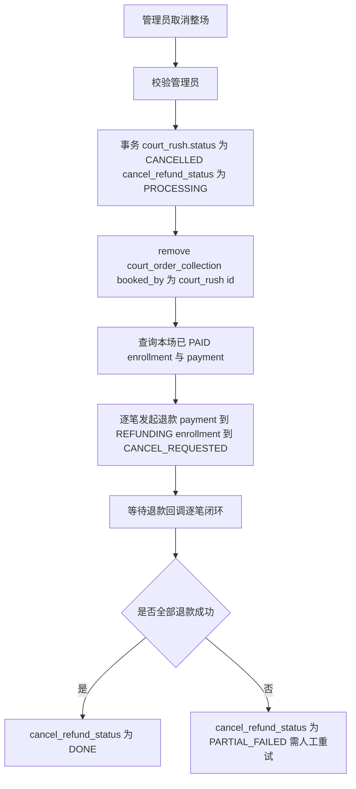

# 畅打模块数据库设计与联动方案（修订版）

目标不变：不改动现有 pay_order、order_create_callback、order_refund_callback、get_court_order、cancel_order；畅打支付/退款走独立集合与独立回调。在**无跨集合事务**条件下，通过 court_rush 单文档上的带条件原子更新（名额闸门）保证高并发报名不超卖，通过幂等门禁保证支付/退款回调重复到达不重复加减计数，通过条件更新实现占位超时释放，通过补偿与对账保证跨集合数据最终一致性可收敛。

---

## 前提与依据（必须遵守）

1. **小程序云开发数据库不支持跨集合事务**，跨集合写入无法在同一事务中提交。
2. **单文档 update 原子性**：根据腾讯云官方说明，云数据库的单次 update 操作是原子操作；在 update 执行过程中，不会被其他并发写操作同时修改同一条数据。
3. **字段更新指令原子执行**：inc、mul、push 等字段更新指令在云数据库中以原子方式执行，不会受到并发写的影响。
4. **表述边界**：官方文档未明确声明 CAS、锁模型或条件更新语义，因此本设计**禁止使用“官方提供 CAS / 乐观锁 / 行锁”等表述**，仅基于上述 update 原子性做工程层推导；可使用“带条件的原子更新”“单文档并发闸门”“工程层 CAS 行为”等描述实现方式。

---

## 一、现有表与流程（简要）

- **court_order_collection**：场地订单集合，字段含 court_id、status(free/locked/booked)、booked_by、**source_type**（COURT_RUSH=畅打占用 / PAY_ORDER=普通预订 / 空=管理员订场）、campus、courtNumber、date、start_time、end_time、price、version、created_at、updated_at。
- **pay_order**：支付订单，字段含 outTradeNo、phoneNumber、court_ids、campus、total_fee、status(PENDING/PAIDED/CANCEL/REFUNDED) 等；支付成功回调 order_create_callback 把 court_order_collection 中对应 court_ids 更新为 booked；退款回调 order_refund_callback 删除对应 court_order_collection 记录。
- **管理员订场**：update_court_order 直接写入 court_order_collection 为 booked，无需支付。

---

## 二、Court Rush 相关新表（修订）

### 1. court_rush（畅打主表）

| 字段 | 类型 | 说明 |
|------|------|------|
| _id | String | 主键 |
| court_ids | Array\<String\> | 连续时间段场地 ID，与 court_order_collection.court_id 同格式 |
| campus | String | 校区 |
| max_participants | Number | 参与人数上限 |
| current_participants | Number | 已付人数（PAID enrollment 数）；闸门计数，条件更新维护 |
| held_participants | Number | 占位数（PENDING_PAYMENT 且未过期）；闸门计数，条件更新维护 |
| price_per_person_yuan | Number | 每人报名费（元） |
| status | String | OPEN / FULL / ENDED / CANCELLED |
| created_by | String | 创建者手机号（管理员） |
| start_at | Date | 开始时间（便于筛选/展示） |
| end_at | Date | 结束时间（便于筛选/展示） |
| created_at | Date | 创建时间 |
| updated_at | Date | 更新时间 |

**名额闸门（并发安全核心）**：将并发控制的唯一闸门集中在 court_rush 单条记录上，使用**带条件的单文档 update + 原子 inc** 控制名额。报名发起时：对 court_rush 执行条件 update（条件为 `status=OPEN 且 held_participants+current_participants < max_participants`），更新操作为 `held_participants` 原子 +1；**update 返回的成功条数（如 updated 数量）作为是否抢位成功的唯一依据**（成功条数为 1 即抢位成功，为 0 即满员）。该做法依赖的是**云数据库对单文档 update 原子性的官方保证**（单次 update 原子、inc 等字段更新指令原子执行），不依赖跨集合事务或锁模型。支付成功/退款/超时释放时同样通过带条件的单文档 update 做 held↔current 的原子迁移或扣减。对账任务可修正计数偏差（见“对账/修复”章节）。

### 2. court_rush_enrollment（畅打报名表）

| 字段 | 类型 | 说明 |
|------|------|------|
| _id | String | 主键 |
| court_rush_id | String | 关联 court_rush._id |
| phoneNumber | String | 会员手机号 |
| status | String | PENDING_PAYMENT / PAID / CANCEL_REQUESTED / CANCELLED / EXPIRED / REFUND_FAILED |
| is_vip | Boolean | 是否 VIP（可选留痕） |
| actual_fee_yuan | Number | 实收金额（元，VIP 五折等） |
| expires_at | Date | 占位过期时间（仅 PENDING_PAYMENT） |
| created_at | Date | 创建时间 |
| updated_at | Date | 更新时间 |

**占位 + 过期机制**：enrollment 采用占位模型（PENDING_PAYMENT + expires_at）。流程为：**先对 court_rush 做带条件的原子 update 抢位（held_participants += 1），以 update 成功条数为抢位唯一依据；抢位成功后再创建 enrollment(PENDING_PAYMENT + expires_at) 与 payment(PENDING)**。若 enrollment/payment 创建失败，需通过**补偿逻辑**对 court_rush 执行 held_participants 回滚（带条件 update，避免重复扣减）。**超时未支付的占位**通过**业务触发 + 条件 update + 对账兜底**释放：仅当 enrollment.status=PENDING_PAYMENT 且 expires_at&lt;now 时置 EXPIRED，并对 court_rush 执行 held_participants 原子 -1（条件 held_participants&gt;0）；**报名、列表、详情**等业务入口顺带执行条件 update；对账 court_rush_reconcile 兜底修正。
唯一索引：(court_rush_id, phoneNumber) 唯一
作用：同一场同一手机号只保留一条报名记录，用状态流转（PENDING_PAYMENT / PAID / CANCELLED / EXPIRED）来复用，防止重复报名 / 占位。

### 3. court_rush_payment（畅打报名支付表）

与现有 pay_order 职责分离，专用于畅打报名费，避免改动现有回调。

| 字段 | 类型 | 说明 |
|------|------|------|
| _id | String | 主键 |
| outTradeNo | String | 商户订单号（微信）唯一 |
| wx_transaction_id | String | 微信支付单号（建议） |
| court_rush_id | String | 关联 court_rush._id |
| enrollment_id | String | 关联 court_rush_enrollment._id |
| phoneNumber | String | 用户手机号 |
| total_fee_yuan | Number | 金额（元） |
| status | String | PENDING / PAIDED / CANCEL / REFUNDING / REFUNDED / FAILED |
| createTime | Date | 创建时间 |
| paided_at | Date | 支付成功时间 |
| refundTime | Date | 退款成功时间（可选） |
| wx_refund_id | String | 微信退款单号（建议） |
| notify_time | Date | 回调时间（建议） |
| created_at | Date | 创建时间（冗余可统一） |
| updated_at | Date | 更新时间 |

**f**: 不包含 court_ids：支付/退款回调只更新本表 + enrollment + rush，不操作 court_order_collection。唯一索引：outTradeNo 唯一作用：支付/退款回调通过 outTradeNo 幂等定位，防止重复回调产生重复加减。唯一索引：enrollment_id 唯一作用：一个 enrollment 只能绑定一条支付记录，防止一条报名挂多笔支付单

## 三、索引与唯一约束（必须落地）

**必要性**：无跨集合事务下，唯一约束（或应用层等价约束）是防止重复报名、重复支付、重复占位的核心手段；用户连点/网络重试不会产生多条有效占位或多条支付单。

1. **court_rush_payment**
   - **outTradeNo 唯一**：回调唯一定位，幂等门禁基础。
   - **enrollment_id 唯一**：1 enrollment 仅能绑定 1 payment。

2. **court_rush_enrollment**
   - **(court_rush_id, phoneNumber) 唯一**：同一场同一人仅一条有效报名；建议复用记录实现“取消/过期后再报名”（CANCELLED/EXPIRED → PENDING_PAYMENT），避免插入新记录。

3. **court_order_collection（建议）**
   - 根据现有 court_id 编码规则，保证同一时段同一场地不重复插入：推荐应用层强约束（court_id 本身已包含 date/time/courtNumber 则对 court_id 做唯一），或在库层做唯一索引（若业务允许）。

---

## 四、与现有表的联动（修订）

### 1. court_order_collection 联动

**创建畅打（锁场地并确定）**
- **畅打权限**：仅 manager.courtRushManager=1 或 specialManager=1 可发起；权限低于退款（admin_refund_order 需 specialManager=1）。
- 校验所选 court_ids 冲突规则改为：**仅当存在记录且 status in ('locked','booked') 才冲突**。
- 如果存在 status=free 的记录：应 **update 为 booked**（不要 add 新记录）。
- 如果无记录：可 **add booked 记录**。
- 写入/更新字段与 update_court_order 一致：status: 'booked'，booked_by: court_rush_id，**source_type: 'COURT_RUSH'**，其他字段 campus、courtNumber、date、start_time、end_time、price、version、created_at、updated_at 与现有一致。

**畅打取消/终止（整场取消）**  
允许取消整场时：court_rush.status = CANCELLED；从 court_order_collection remove：court_id in court_ids 且 booked_by === court_rush_id；对已支付用户批量退款（见“整场取消流程”）。

**查询场地占用**  
现有 get_court_order 仅按 court_order_collection 展示状态；source_type='COURT_RUSH' 的条目表示畅打占用，前端可直接据此显示“畅打占用”
### 2. pay_order 不参与畅打

畅打报名费只写 court_rush_payment，不写 pay_order。order_create_callback / order_refund_callback 仅处理 pay_order，不需改分支。我的订单/订单列表继续只查 pay_order；畅打报名列表单独查 enrollment + rush（或 payment）。

---

## 五、核心一致性策略（无跨集合事务）

### 5.1 概念区分

| 概念 | 含义 | 本设计中的实现 |
|------|------|----------------|
| **原子性** | 单条 update 级别：一次 update 要么完整生效，要么不生效；执行过程中同一条文档不会被其他并发写同时修改。 | 依赖云数据库对**单次 update 原子操作**及**字段更新指令（如 inc）原子执行**的官方保证。 |
| **并发安全** | 高并发下名额不超卖、计数不重复加减。 | 将名额闸门集中在 **court_rush 单条记录**上，仅通过**带条件的单文档 update + 原子 inc** 修改 held_participants/current_participants；以 update 成功条数作为抢位/扣减是否生效的唯一依据。不依赖跨集合事务或锁模型。 |
| **最终一致性** | 跨集合数据允许短暂不一致，通过后续动作收敛到一致。 | **幂等门禁**（支付/退款回调仅当 payment.status 处于指定前置状态才执行；重复回调直接返回成功、不再修改计数）+ **补偿**（报名后续步骤失败则回滚 held_participants）+ **对账兜底**（业务触发或按需调用 court_rush_reconcile，以 enrollment/payment 为准修正 rush 计数）。 |

### 5.2 报名流程

- 对 court_rush 执行**带条件的单文档 update**：条件为 `status=OPEN 且 held_participants+current_participants < max_participants`，更新为 `held_participants` 原子 +1。**update 返回成功条数作为是否抢位成功的唯一依据**（成功条数为 1 即抢位成功，为 0 即满员）。
- 抢位成功（成功条数=1）后，再创建 enrollment(PENDING_PAYMENT + expires_at) 与 payment(PENDING)。若 enrollment/payment 创建失败，**必须补偿**：对 court_rush 执行带条件的 update 将 held_participants 原子 -1（条件 held_participants&gt;0，避免重复扣减）。

### 5.3 支付回调

- 以 payment.outTradeNo 唯一定位。**幂等门禁**：仅当 payment.status 处于**指定前置状态 PENDING** 时才执行状态流转与计数修改；否则视为重复回调，**直接返回成功，不再修改任何计数**。
- 执行顺序（每步均为带条件的单文档 update，保证只执行一次）：
  - a) payment PENDING→PAIDED（条件更新）
  - b) enrollment PENDING_PAYMENT→PAID（条件更新）
  - c) court_rush held_participants 原子 -1、current_participants 原子 +1（条件更新）
- 任一步失败：记录 pending_fix 或进入补偿队列，由对账任务 court_rush_reconcile 修复。

### 5.4 退款流程

- 先带条件 update：payment PAIDED→REFUNDING、enrollment PAID→CANCEL_REQUESTED；再调微信退款。
- 退款回调**幂等门禁**：仅当 payment.status 处于**指定前置状态 REFUNDING** 时才执行；否则直接返回成功、不修改计数。执行条件更新：payment REFUNDING→REFUNDED、enrollment→CANCELLED、court_rush current_participants 原子 -1。任一步失败由对账修复。

### 5.5 超时释放

- **业务触发**（报名、列表、详情时顺带）+ **条件 update**（仅当 enrollment.status=PENDING_PAYMENT 且 expires_at&lt;now 时置 EXPIRED，并对 court_rush 执行 held_participants 原子 -1）+ **对账兜底**；不用定时云函数。

### 5.6 补偿 / 对账机制（court_rush_reconcile）

- **允许短暂不一致**：因无跨集合事务，可能出现“court_rush.held 已 +1 但 enrollment 尚未写入”等瞬态；通过补偿与对账收敛。
- **对账云函数（对账兜底）**：由业务触发或按需调用，扫描以下不一致并修复：
  - rush.held_participants 与 enrollment 中未过期 PENDING_PAYMENT 数不一致；
  - rush.current_participants 与 enrollment 中 PAID 数不一致；
  - payment=PAIDED 但 enrollment 非 PAID；
  - enrollment=PAID 但 payment 非 PAIDED。
- **修复原则**：以 payment/enrollment 状态为准调整 court_rush 计数（held_participants、current_participants），保证最终一致性；无法自动修复的标记异常单，人工处理。

---

## 六、核心流程（修订版）

```mermaid
flowchart TB
    subgraph create [创建畅打]
        A1[管理员选择连续时间段] --> A2[校验 court_order_collection 冲突 locked/booked]
        A2 --> A3[事务: update free 为 booked 或 add booked, booked_by court_rush id]
        A3 --> A4[事务: 插入 court_rush 记录 写入 venue_total_fee_yuan start_at end_at]
    end
    subgraph signup [会员报名 占位到支付]
        B1["court_rush 带条件 update+原子 inc held+=1"] --> B2{update 成功条数=1?}
        B2 -->|否| BFull[满员返回]
        B2 -->|是| B3[创建 enrollment PENDING_PAYMENT + payment PENDING]
        B3 --> B4[调起微信支付]
        B4 --> B5[支付回调: 幂等门禁 仅 PENDING 执行]
        B5 --> B6["条件更新: payment→PAIDED, enrollment→PAID, rush held-=1 paid+=1"]
        B6 --> B7[失败则 pending_fix/对账修复]
    end
    subgraph cancel [取消报名 退款闭环]
        C1[用户取消] --> C2[条件 update payment→REFUNDING enrollment→CANCEL_REQUESTED]
        C2 --> C3[微信退款回调 幂等门禁 仅 REFUNDING 执行]
        C3 --> C4[条件 update payment→REFUNDED enrollment→CANCELLED paid-=1]
    end
    subgraph expire [占位过期释放]
        D1[业务触发: 报名/列表/详情顺带] --> D2["条件 update: 仅 PENDING_PAYMENT 且 expires_at<now 置 EXPIRED"]
        D2 --> D3[条件 update court_rush held 原子 -1]
    end
```

---

## 七、详细流程（修订）

### 7.1 创建畅打流程图（详细）

### 7.2 报名流程图（详细）

### 7.3 取消报名退款流程图（详细）

---

## 八、整场取消（新增流程，建议）

需求里提到“若业务允许取消整场畅打”，此处补齐已支付用户的退款闭环与可追踪状态。

### 8.1 业务规则建议

整场取消后：场地释放（删 booked）；已支付报名逐笔发起退款；退款成功后 enrollment 变 CANCELLED，payment 变 REFUNDED。

### 8.2 需要补充字段（可选）

- court_rush.cancel_refund_status: NOT_STARTED / PROCESSING / DONE / PARTIAL_FAILED
- court_rush.cancelled_at

### 8.3 整场取消流程图（可选）

---

## 九、需新增的云函数（修订）

| 云函数 | 职责 |
|--------|------|
| court_rush_create | 校验畅打权限（manager.courtRushManager=1 或 specialManager=1）；校验 court_ids 冲突仅看 locked/booked；事务内对 free 记录做 update 为 booked、缺失记录 add booked；插入 court_rush 并写入 venue_total_fee_yuan/start_at/end_at |
| court_rush_enroll | 清理过期占位（可选）；校验重复 enrollment；**先对 court_rush 带条件 update+原子 inc held+1（条件 status=OPEN 且 held+paid&lt;max），以 update 成功条数为抢位依据**；抢位成功后再创建 enrollment(PENDING_PAYMENT+expires_at)、payment(PENDING)；失败则补偿 held-1；返回支付参数 |
| court_rush_order_callback | 支付回调：按 outTradeNo 定位；**幂等门禁仅当 payment.status=PENDING 执行**，重复回调直接返回成功、不修改计数；条件更新：payment→PAIDED、enrollment→PAID、court_rush held-=1 paid+=1；任一步失败记录 pending_fix/对账修复 |
| court_rush_refund | 用户取消报名：条件更新 payment→REFUNDING、enrollment→CANCEL_REQUESTED；调微信退款 |
| court_rush_refund_callback | 退款回调：按 outTradeNo 定位；**幂等门禁仅当 payment.status=REFUNDING 执行**，重复回调直接返回成功、不修改计数；条件更新 payment→REFUNDED、enrollment→CANCELLED、court_rush paid-=1 |
| court_rush_cleanup_expired | 清理过期占位：**条件 update** 仅当 enrollment.status=PENDING_PAYMENT 且 expires_at&lt;now 置 EXPIRED，并 court_rush held 原子 -1；由 court_rush_enroll、court_rush_list、court_rush_detail 等业务入口顺带调用，非定时 |
| court_rush_reconcile | 对账/修复：扫描 rush.held 与未过期 PENDING_PAYMENT 数、rush.paid 与 PAID 数、payment=PAIDED 但 enrollment 非 PAID、enrollment=PAID 但 payment 非 PAIDED；以 payment/enrollment 为准修正 rush 计数，保证最终一致；异常单标记人工处理 |
| court_rush_cancel | 管理员整场取消：rush 到 CANCELLED、释放场地、批量对已支付报名发起退款并跟踪 cancel_refund_status |
| court_rush_list / court_rush_detail | 列表与详情查询（按需） |

**支付回调路由**：使用独立回调 URL 或 outTradeNo 前缀区分畅打订单，确保只进入 court_rush_*_callback。

---

## 十、兼容与约束小结（修订）

- **兼容现有表**：court_order_collection 仅新增 source_type 字段以标识畅打占用；pay_order 不改；get_court_order、order_create_callback、order_refund_callback、cancel_order 逻辑不改。
- **联动点**：court_order_collection 通过 court_id + booked_by=court_rush_id（source_type=COURT_RUSH）与畅打绑定。
- **无跨集合事务下的并发与一致性**：实现的是**最终一致性**。**并发安全**（高并发报名不超卖）来自将名额闸门集中在 **court_rush 单条记录**上，仅通过**带条件的单文档 update + 原子 inc** 修改 held/paid，依赖云数据库对单文档 update 原子性的官方保证；以 update 成功条数作为抢位/扣减是否生效的唯一依据。**支付/退款回调不重复加减计数**：通过幂等门禁（仅当 payment.status 处于指定前置状态才执行，重复回调直接返回成功、不修改计数）。**占位超时释放**：通过条件 update 原子释放 held。**跨集合最终一致**：报名先带条件 update held+1、再写 enrollment/payment，失败补偿 held-1；回调分步条件更新，失败由对账 court_rush_reconcile 修复。
- **创建畅打**：冲突判断仅 locked/booked；free 记录 update；缺失记录 add；尽量事务化。
- **报名**：先带条件 update+原子 inc held+1（以成功条数为依据），再创建 enrollment+payment；超时清理条件 update EXPIRED + held 原子 -1。
- **支付/取消**：回调幂等门禁（仅指定前置状态执行）+ 条件更新；计数迁移 held↔paid 在 court_rush 上带条件原子 update。
- **对账兜底**：业务触发或按需调用 court_rush_reconcile，以 payment/enrollment 状态为准修正 rush 计数，保证最终一致。

---

## 附录：畅打需求整理

### 一、业务需求

| 序号 | 需求描述 | 对应设计要点 |
|------|----------|--------------|
| 1 | 锁场地后**立即确定**，无需用户支付确认，效果等同管理员订场 | 创建畅打时直接向 court_order_collection 写入/更新 status=booked，booked_by=court_rush_id、source_type=COURT_RUSH；冲突仅看 locked/booked，free 则 update |
| 2 | 一场畅打包含**多个连续时间段**的场地 | court_rush.court_ids 数组，与 court_order_collection.court_id 同格式 |
| 3 | 畅打有**独立主记录**，记录本场定了哪些场地、多少人、价格等 | court_rush 表：court_ids、max_participants、current_participants、price_per_person_yuan、status、venue_total_fee_yuan 等 |
| 4 | 畅打需**指定参与人数上限**，满员后不可再报名 | max_participants；名额 = PAID + 未过期 PENDING_PAYMENT |
| 5 | 会员可**报名**，报名成功后把自己**记入该场畅打** | court_rush_enrollment 表，status=PAID 即已报名；占位 PENDING_PAYMENT+expires_at |
| 6 | 报名即产生**一条支付记录**，**付款成功才算报名成功** | court_rush_payment 表；支付回调幂等门禁（仅 PENDING 执行）+ 条件更新：payment→PAIDED、enrollment→PAID、court_rush held-=1 paid+=1 |
| 7 | 会员可**取消报名**：先发起退款，**退款成功**后再从畅打参与中移除 | 先标记 REFUNDING/CANCEL_REQUESTED；退款回调幂等门禁（仅 REFUNDING 执行）+ 条件更新：payment→REFUNDED、enrollment→CANCELLED、court_rush paid-=1 |
| 8 | **VIP 会员**报名费**五折** | 报名时调 club_member 判 VIP，actual_fee_yuan 按实收；enrollment/payment 留痕 is_vip、actual_fee_yuan |
| 9 | 可统计**该场畅打总费用**：场地总价值、报名费总收入 | venue_total_fee_yuan（创建时汇总）；total_revenue_yuan（回调条件更新维护或聚合、对账可修正） |
| 10 | **整场取消**时释放场地并对已支付用户批量退款 | court_rush_cancel；cancel_refund_status、cancelled_at；逐笔退款并跟踪 PARTIAL_FAILED |

### 二、技术需求

| 类别 | 需求描述 | 实现方式 |
|------|----------|----------|
| 无跨集合事务 | 云开发不支持跨集合事务；实现最终一致性，仍保证高并发不超卖、回调不重复加减 | 名额闸门集中在 court_rush 单条记录：带条件的单文档 update+原子 inc，以 update 成功条数为抢位依据，依赖云数据库单文档 update 原子性（非锁/非官方 CAS）；跨集合动作幂等门禁+补偿+对账 court_rush_reconcile 收敛 |
| 兼容现有系统 | 不改动现有场地预订、支付、取消、回调逻辑 | 畅打支付使用独立集合 court_rush_payment，独立回调 court_rush_*_callback |
| 与场地表联动 | 畅打占用场地在场地表中可查；free 记录 update 为 booked 不重复 add | 冲突仅 locked/booked；存在 free 则 update，无记录则 add；booked_by=court_rush_id，source_type=COURT_RUSH |
| 幂等与补偿 | 支付/退款回调不重复计数、不串单；跨集合失败可补偿 | 支付回调仅当 payment.status=PENDING 执行，重复回调直接返回成功、不修改计数；退款仅 REFUNDING；每步条件更新；报名抢位成功后若 enrollment/payment 失败则补偿 held-1；对账修正计数 |
| 索引与唯一 | 不超卖、不重复报名、1 enrollment 1 payment | outTradeNo 唯一；enrollment_id 唯一；(court_rush_id, phoneNumber) 唯一；court_id 应用层或库层唯一 |
| 占位与过期 | 未支付占位不永久占满名额；超时可释放；不用定时云函数 | PENDING_PAYMENT+expires_at；**业务触发**（报名/列表/详情顺带）+ **条件 update**（expires_at&lt;now 置 EXPIRED 并 held-=1）+ **对账兜底** |
| 整场取消 | 场地释放 + 已支付批量退款可追踪 | court_rush_cancel；cancel_refund_status、cancelled_at；PARTIAL_FAILED 人工重试 |
