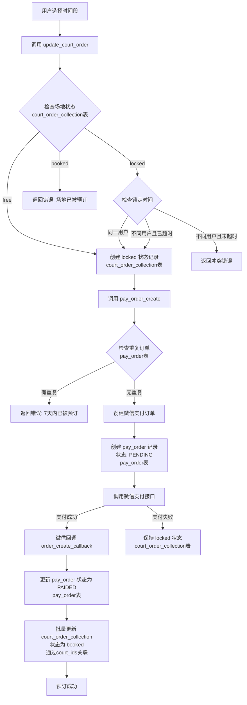
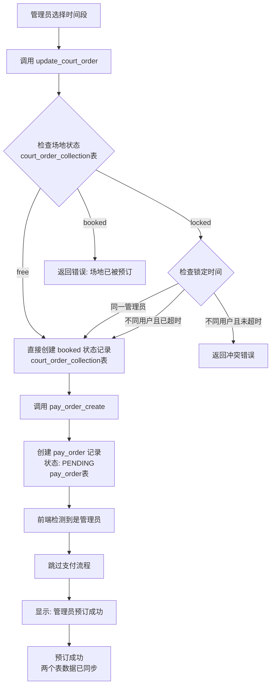
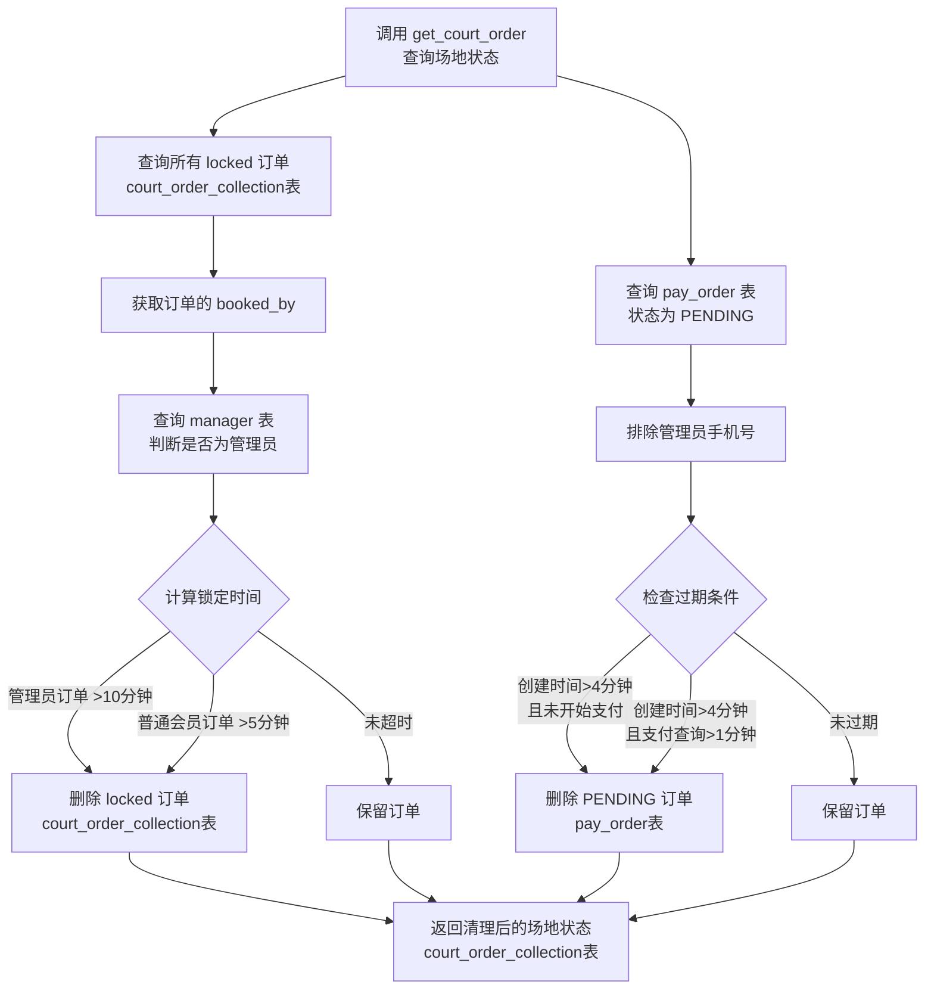
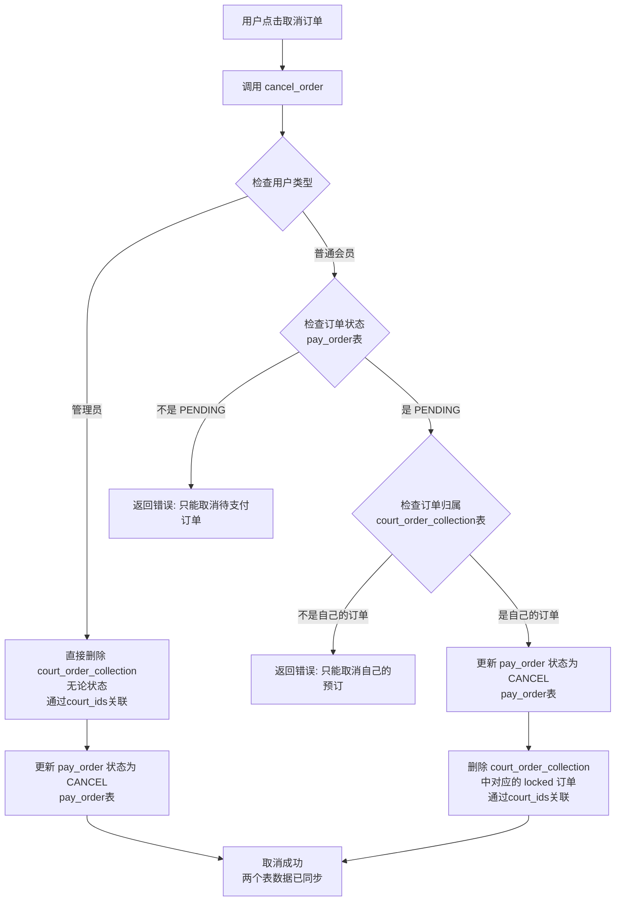
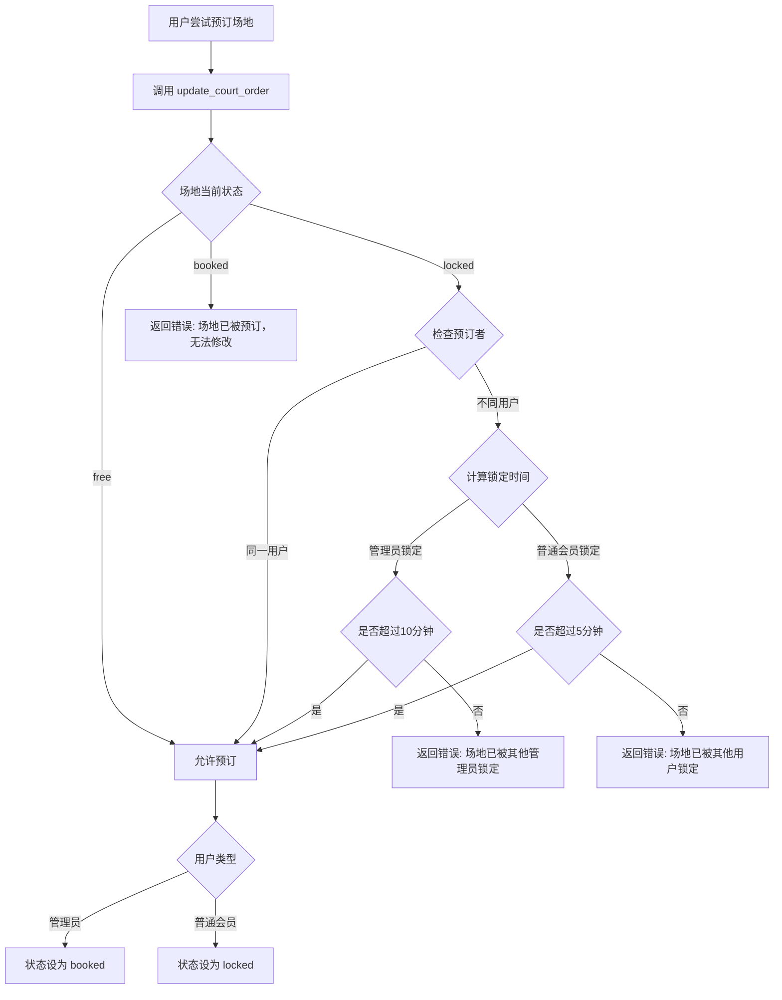

# 场地预订流程说明文档

## 一、概述

本文档详细说明了场地预订系统中占用锁定场地、过期取消、付费确定场地的处理流程，包括普通会员和管理员的不同处理逻辑。

## 二、核心概念

### 2.1 数据表说明

系统使用**两个独立的表**来管理场地预订：

1. **`court_order_collection`（场地订单集合表）**
   - **作用**：存储场地的实际状态和预订信息
   - **状态**：`free`（空闲）、`locked`（锁定）、`booked`（已预订）
   - **用途**：用于展示场地可用性、检查冲突、控制锁定时间

2. **`pay_order`（支付订单表）**
   - **作用**：存储支付订单信息和支付状态
   - **状态**：`PENDING`（待支付）、`PAIDED`（已支付）、`CANCEL`（已取消）
   - **用途**：管理支付流程、记录支付信息、处理支付回调

**两个表的关系**：
- `court_order_collection` 通过 `court_id` 字段标识场地时间段
- `pay_order` 通过 `court_ids` 数组字段关联多个场地时间段
- 支付成功后，需要同步更新两个表的状态
- 两个表的数据需要保持一致，但各自承担不同的职责

### 2.2 用户类型

- **管理员**：拥有特殊权限的用户，可以预订任何场地，无需支付
- **普通会员**：一般用户，需要支付才能确认预订

### 2.3 订单状态

| 状态 | 说明 | 可操作 |
|------|------|--------|
| `free` | 空闲状态 | 可以被任何用户预订 |
| `locked` | 锁定状态 | 用户已预订但未支付，有锁定时间限制 |
| `booked` | 已预订状态 | 支付完成，不可更改 |

### 2.4 锁定时间规则

| 用户类型 | 锁定时间 | 说明 |
|---------|---------|------|
| 管理员 | 10分钟 | 管理员预订后有10分钟支付时间（实际管理员无需支付） |
| 普通会员 | 5分钟 | 普通会员预订后有5分钟支付时间 |

## 三、完整流程

### 3.1 占用锁定场地流程

#### 3.1.1 普通会员流程

```
用户选择时间段
    ↓
调用 update_court_order 云函数
    ↓
【操作 court_order_collection 表】
检查场地状态
    ├─ 如果场地是 free → 创建 locked 状态记录
    ├─ 如果场地是 locked → 检查锁定时间
    │   ├─ 同一用户 → 允许更新
    │   ├─ 不同用户且未超时 → 返回冲突错误
    │   └─ 不同用户且已超时 → 允许更新
    └─ 如果场地是 booked → 返回"场地已被预订"错误
    ↓
【操作 court_order_collection 表】
场地状态变为 locked
    ↓
调用 pay_order_create 云函数
    ↓
【操作 pay_order 表】
创建支付订单（状态：PENDING）
```

**说明**：
- `update_court_order` 只操作 `court_order_collection` 表，将场地状态设为 `locked`
- `pay_order_create` 操作 `pay_order` 表，创建支付订单记录
- 两个表的数据通过 `court_id` 和 `court_ids` 字段关联

#### 3.1.2 管理员流程

```
管理员选择时间段
    ↓
调用 update_court_order 云函数
    ↓
【操作 court_order_collection 表】
检查场地状态
    ├─ 如果场地是 free → 直接创建 booked 状态记录
    ├─ 如果场地是 locked → 检查锁定时间
    │   ├─ 同一管理员 → 允许更新
    │   ├─ 不同用户且未超时 → 返回冲突错误
    │   └─ 不同用户且已超时 → 允许更新
    └─ 如果场地是 booked → 返回"场地已被预订"错误
    ↓
【操作 court_order_collection 表】
场地状态直接变为 booked（无需支付）
    ↓
调用 pay_order_create 云函数
    ↓
【操作 pay_order 表】
创建支付订单记录（状态：PENDING，但实际无需支付）
```

**说明**：
- 管理员在 `update_court_order` 中直接将 `court_order_collection` 表的状态设为 `booked`
- `pay_order` 表仍会创建记录，但前端会跳过支付流程

### 3.2 过期取消流程

过期取消分为两个层面：

#### 3.2.1 court_order_collection 表过期清理

**触发时机**：每次调用 `get_court_order` 查询场地状态时

**清理规则**：
- **管理员锁定订单**：超过10分钟自动删除
- **普通会员锁定订单**：超过5分钟自动删除

**清理逻辑**：
```
查询所有 locked 状态的订单
    ↓
获取订单的 booked_by（预订者手机号）
    ↓
查询 manager 表，判断是否为管理员
    ↓
计算锁定时间差
    ├─ 管理员订单：超过10分钟 → 删除
    └─ 普通会员订单：超过5分钟 → 删除
```

#### 3.2.2 pay_order 表过期清理

**触发时机**：每次调用 `get_court_order` 查询场地状态时

**清理规则**（仅针对普通会员）：
- 创建时间超过4分钟且未开始支付（`paymentQueryTime` 为 null）
- 创建时间超过4分钟且支付查询时间超过1分钟

**清理逻辑**：
```
查询 pay_order 表中状态为 PENDING 的订单
    ↓
排除管理员手机号
    ↓
检查过期条件
    ├─ 创建时间超过4分钟 且 paymentQueryTime 为 null → 删除
    └─ 创建时间超过4分钟 且 paymentQueryTime 超过1分钟 → 删除
```

### 3.3 付费确定场地流程

#### 3.3.1 普通会员付费流程

```
【court_order_collection 表】
锁定场地成功（状态：locked）
    ↓
调用 pay_order_create 云函数
    ├─ 【pay_order 表】检查重复订单（7天内相同场地）
    ├─ 创建微信支付订单
    └─ 【pay_order 表】创建支付订单记录（状态：PENDING）
    ↓
调用微信支付接口
    ↓
支付成功
    ↓
微信回调 order_create_callback 云函数
    ↓
【pay_order 表】
更新支付订单状态为 PAIDED
    ↓
【court_order_collection 表】
批量更新场地状态为 booked（通过 court_ids 关联）
    ↓
场地确认预订成功
```

**说明**：
- `pay_order_create` 只操作 `pay_order` 表
- `order_create_callback` 需要同步更新两个表：
  - 更新 `pay_order` 表状态为 `PAIDED`
  - 更新 `court_order_collection` 表中对应 `court_id` 的状态为 `booked`
- 两个表通过 `court_ids` 数组和 `court_id` 字段关联

#### 3.3.2 管理员预订流程

```
管理员选择时间段
    ↓
调用 update_court_order 云函数
    ↓
【court_order_collection 表】
场地状态直接设为 booked（无需支付）
    ↓
调用 pay_order_create 云函数
    ↓
【pay_order 表】
创建支付订单记录（状态：PENDING，但实际不调用支付）
    ↓
前端检测到是管理员，跳过支付流程
    ↓
显示"管理员预订成功"
    ↓
场地确认预订成功
```

**说明**：
- 管理员在 `update_court_order` 中直接将 `court_order_collection` 表状态设为 `booked`
- `pay_order` 表仍会创建记录，但状态保持 `PENDING`（管理员无需支付）

### 3.4 取消订单流程

#### 3.4.1 普通会员取消流程

```
用户点击取消订单
    ↓
调用 cancel_order 云函数
    ↓
【pay_order 表】
检查订单状态
    ├─ 状态不是 PENDING → 返回"只能取消待支付的订单"
    └─ 状态是 PENDING → 继续
    ↓
【court_order_collection 表】
检查订单归属
    ├─ 不是自己的订单 → 返回"只能取消自己的预订"
    └─ 是自己的订单 → 继续
    ↓
【pay_order 表】
更新支付订单状态为 CANCEL
    ↓
【court_order_collection 表】
删除对应的 locked 订单（通过 court_ids 关联）
    ↓
取消成功
```

**说明**：
- `cancel_order` 需要同时操作两个表：
  - 更新 `pay_order` 表状态为 `CANCEL`
  - 删除 `court_order_collection` 表中对应的 `locked` 记录
- 通过 `court_ids` 数组找到需要删除的场地记录

#### 3.4.2 管理员取消流程

```
管理员点击取消订单
    ↓
调用 cancel_order 云函数
    ↓
检测到是管理员
    ↓
【court_order_collection 表】
直接删除场地记录（无论状态，通过 court_ids 关联）
    ↓
【pay_order 表】
更新支付订单状态为 CANCEL
    ↓
取消成功
```

**说明**：
- 管理员可以取消任何状态的订单
- 需要同时操作两个表，确保数据一致性

## 四、冲突处理规则

### 4.1 锁定冲突处理

| 场景 | 处理方式 |
|------|---------|
| 管理员锁定 vs 管理员锁定 | 10分钟内不允许其他管理员预订 |
| 普通会员锁定 vs 普通会员锁定 | 5分钟内不允许其他会员预订 |
| 管理员锁定 vs 普通会员 | 10分钟内不允许普通会员预订 |
| 普通会员锁定 vs 管理员 | 5分钟内不允许管理员预订 |
| 已预订（booked） | 任何用户都无法修改 |

### 4.2 同一用户更新

- 用户可以随时更新自己的锁定订单
- 不检查锁定时间限制
- 允许修改时间段、价格等信息

## 五、关键云函数说明

### 5.1 update_court_order

**功能**：更新或创建场地订单

**关键逻辑**：
- 检查用户是否为管理员
- 管理员：状态直接设为 `booked`
- 普通会员：状态设为 `locked`
- 检查冲突和锁定时间
- 使用版本号控制并发

### 5.2 pay_order_create

**功能**：创建支付订单

**关键逻辑**：
- 检查7天内重复订单
- 创建微信支付订单
- 设置支付超时时间（5.2分钟）
- 创建 `pay_order` 记录

### 5.3 order_create_callback

**功能**：支付成功回调

**关键逻辑**：
- **操作 `pay_order` 表**：更新状态为 `PAIDED`，记录支付时间
- **操作 `court_order_collection` 表**：通过 `court_ids` 批量更新对应场地状态为 `booked`
- 确保两个表的数据同步更新

### 5.4 get_court_order

**功能**：查询场地订单状态

**关键逻辑**：
- **操作 `court_order_collection` 表**：清理过期的 `locked` 订单
- **操作 `pay_order` 表**：清理过期的 `PENDING` 订单
- 返回 `court_order_collection` 表的场地状态列表

### 5.5 cancel_order

**功能**：取消订单

**关键逻辑**：
- **操作 `pay_order` 表**：更新状态为 `CANCEL`
- **操作 `court_order_collection` 表**：删除对应的场地记录（通过 `court_ids` 关联）
- 管理员：可以取消任何状态订单，直接删除 `court_order_collection` 记录
- 普通会员：只能取消 `PENDING` 状态的订单，且只能删除自己的 `locked` 记录

## 六、双表设计说明

### 6.1 为什么使用两个表？

系统采用**双表设计**，将场地状态管理和支付流程管理分离：

1. **职责分离**：
   - `court_order_collection`：专注于场地状态管理（空闲/锁定/已预订）
   - `pay_order`：专注于支付流程管理（待支付/已支付/已取消）

2. **性能优化**：
   - 查询场地状态时，主要查询 `court_order_collection` 表
   - 查询订单列表时，主要查询 `pay_order` 表
   - 避免单表数据过大，提高查询效率

3. **业务逻辑清晰**：
   - 场地状态变化和支付状态变化是独立的业务流程
   - 两个表各自管理自己的状态，逻辑更清晰

### 6.2 两个表的关联关系

```
┌─────────────────────────────────┐
│      pay_order（支付订单表）      │
├─────────────────────────────────┤
│ _id: "order_123"                │
│ phoneNumber: "13800138000"      │
│ court_ids: [                    │
│   "1号_20250101_10:00",        │
│   "1号_20250101_10:30",         │
│   "2号_20250101_10:00"          │
│ ]                               │
│ status: "PAIDED"                │
└────────────┬────────────────────┘
             │
             │ 通过 court_ids 数组关联
             │
             ▼
┌─────────────────────────────────┐
│ court_order_collection（场地表） │
├─────────────────────────────────┤
│ court_id: "1号_20250101_10:00" │
│ status: "booked"                 │
│ booked_by: "13800138000"        │
├─────────────────────────────────┤
│ court_id: "1号_20250101_10:30" │
│ status: "booked"                 │
│ booked_by: "13800138000"        │
├─────────────────────────────────┤
│ court_id: "2号_20250101_10:00" │
│ status: "booked"                 │
│ booked_by: "13800138000"        │
└─────────────────────────────────┘
```

**关联方式**：
- `pay_order.court_ids` 是一个字符串数组，包含多个场地ID
- `court_order_collection.court_id` 是单个场地ID（唯一标识）
- 一个支付订单可以包含多个场地时间段
- 支付成功后，需要同步更新 `court_order_collection` 中所有相关记录

### 6.3 数据同步机制

**需要同步的场景**：

1. **支付成功时**（`order_create_callback`）：
   ```
   pay_order 表：PENDING → PAIDED
   court_order_collection 表：locked → booked（批量更新）
   ```

2. **取消订单时**（`cancel_order`）：
   ```
   pay_order 表：PENDING → CANCEL
   court_order_collection 表：删除对应的 locked 记录
   ```

3. **管理员预订时**：
   ```
   court_order_collection 表：直接设为 booked
   pay_order 表：创建 PENDING 记录（但无需支付）
   ```

**同步原则**：
- 两个表的数据必须保持一致
- 支付状态变化时，必须同步更新场地状态
- 取消订单时，必须同时操作两个表

## 七、数据表结构

### 6.1 表关系说明

系统使用**两个独立的表**来管理场地预订，它们的关系如下：

```
pay_order（支付订单表）
    │
    │ court_ids: ["1号_20250101_10:00", "1号_20250101_10:30", ...]
    │
    └─── 关联 ───┐
                │
                ▼
court_order_collection（场地订单集合表）
    court_id: "1号_20250101_10:00"
    court_id: "1号_20250101_10:30"
    ...
```

**关联关系**：
- `pay_order.court_ids` 是一个数组，包含多个场地ID
- `court_order_collection.court_id` 是单个场地ID
- 一个支付订单可以包含多个场地时间段
- 支付成功后，需要同步更新 `court_order_collection` 中所有相关记录的状态

### 6.2 court_order_collection（场地订单集合表）

**表作用**：存储场地的实际状态和预订信息，用于展示场地可用性

| 字段 | 类型 | 说明 |
|------|------|------|
| court_id | String | 场地ID（格式：场地号_日期_时间，唯一标识） |
| campus | String | 校区 |
| courtNumber | String | 场地号 |
| date | String | 日期 |
| start_time | String | 开始时间 |
| end_time | String | 结束时间 |
| status | String | 状态（free/locked/booked） |
| price | Number | 价格 |
| booked_by | String | 预订者手机号 |
| version | Number | 版本号（用于并发控制） |
| created_at | Date | 创建时间 |
| updated_at | Date | 更新时间 |

**关键说明**：
- 每个场地时间段对应一条记录
- `status` 字段控制场地的可用性
- `updated_at` 字段用于计算锁定时间

### 6.3 pay_order（支付订单表）

**表作用**：存储支付订单信息和支付状态，管理支付流程

| 字段 | 类型 | 说明 |
|------|------|------|
| _id | String | 订单ID（主键） |
| outTradeNo | String | 商户订单号（微信支付订单号） |
| phoneNumber | String | 用户手机号 |
| court_ids | Array | 场地ID数组（关联 court_order_collection） |
| campus | String | 校区 |
| total_fee | Number | 总金额 |
| status | String | 状态（PENDING/PAIDED/CANCEL） |
| createTime | Date | 创建时间 |
| paymentQueryTime | Date | 支付查询时间（首次查询支付时记录） |
| paymentExpireTime | Date | 支付过期时间 |
| payment_parmas | Object | 微信支付参数 |

**关键说明**：
- 一个支付订单可以包含多个场地时间段（`court_ids` 数组）
- `status` 字段管理支付状态
- `paymentQueryTime` 用于判断是否已开始支付流程

## 八、流程图

### 7.1 普通会员完整预订流程



### 7.2 管理员预订流程



### 7.3 过期清理流程



### 7.4 取消订单流程对比



### 7.5 冲突处理流程



## 九、注意事项

1. **双表设计**：
   - `court_order_collection` 表负责场地状态管理
   - `pay_order` 表负责支付流程管理
   - 两个表需要保持数据一致性，支付成功时需要同步更新

2. **并发控制**：使用版本号（version）字段控制并发更新

3. **事务性**：`update_court_order` 使用事务性操作，确保数据一致性

4. **过期清理**：过期清理在查询时被动触发，不是定时任务
   - `court_order_collection` 表的过期清理：删除过期的 `locked` 记录
   - `pay_order` 表的过期清理：删除过期的 `PENDING` 记录

5. **管理员特权**：管理员可以跳过支付，直接确认预订
   - `court_order_collection` 表直接设为 `booked`
   - `pay_order` 表仍会创建记录，但状态保持 `PENDING`

6. **锁定时间**：锁定时间从 `updated_at` 字段计算，不是从创建时间

7. **重复订单检查**：创建支付订单时会检查7天内是否有重复订单（基于 `pay_order` 表）

8. **数据同步**：
   - 支付成功时，`order_create_callback` 需要同步更新两个表
   - 取消订单时，`cancel_order` 需要同时操作两个表
   - 确保两个表的数据保持一致

## 十、错误处理

| 错误场景 | 错误信息 |
|---------|---------|
| 场地已被预订 | "场地已被预订，无法修改" |
| 场地被锁定（管理员） | "场地已被其他管理员锁定，请稍后再试" |
| 场地被锁定（普通会员） | "场地已被其他用户锁定，请稍后再试" |
| 重复订单 | "所选场地在7天内已被预订，请选择其他场地" |
| 只能取消待支付订单 | "只能取消待支付的订单" |
| 只能取消自己的订单 | "只能取消自己的预订" |

